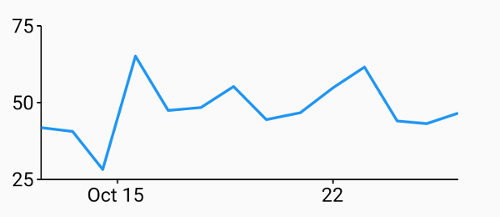
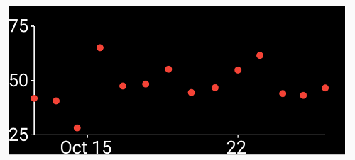

# Chartflo

Tired of the boilerplate? Chartflo is a wrapper around different charting libraries to make the Flutter developer's life easier. Features:

- **Easy**: simple api, no learning curve
- **Simple**: minimal code and abstraction complexity

## Timeseries

   ```dart
   final dataset = <DateTime,num>{someDate1: 5, someDate2: 8 /* ... */};
   Widget chart = TimeSerieChart(dataset: dataset);
   ```



### Chart options

   ```dart
   Container(
      height: 200.0,
      color: Colors.black,
      child: TimeSerieChart(
         dataset: dataset,
         lineColor: Colors.red,
         textColor: Colors.white,
         axisColor: Colors.white,
         showPoints: true,
         showLine: false,
         fontSize: 18));
   ```



### Resample data

The timeseries can be grouped by time periods prior to charting: example:

   ```dart
   Widget chart = TimeSerieChart(
      dataset: dataset,
      showPoints: true,
      showArea: true,
      resample: Resample(timePeriod: const Duration(days: 1))
   );
   ```

This will group and mean the data by one day. Check the example for more details. A
standalone function is available to resample data outside of a chart:

   ```dart
   final newSerie = TimeFrame.resample(
      dataset: <DateTime, num>[ /* some data */ ],
      timePeriod: const Duration(hours: 1),
      resampleMethod = ResampleMethod.sum);
   ```

## Sparkline

A simple sparkline is available:

   ```dart
   SparklineChart(
      dataset: <double>[1.2, 2.3, 1.7],
      lineColor: Colors.blueGrey,
      lineWidth: 2.0,
      areaColor: Colors.grey[200])
   ```

## Todo

- [ ] Bezier line timeserie
- [ ] Bar charts
- [ ] Manage interactivity
